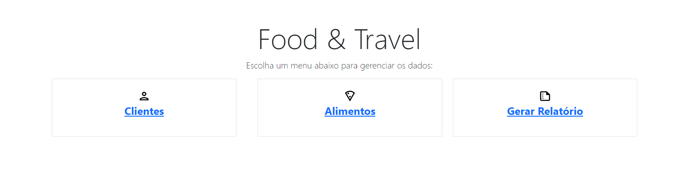
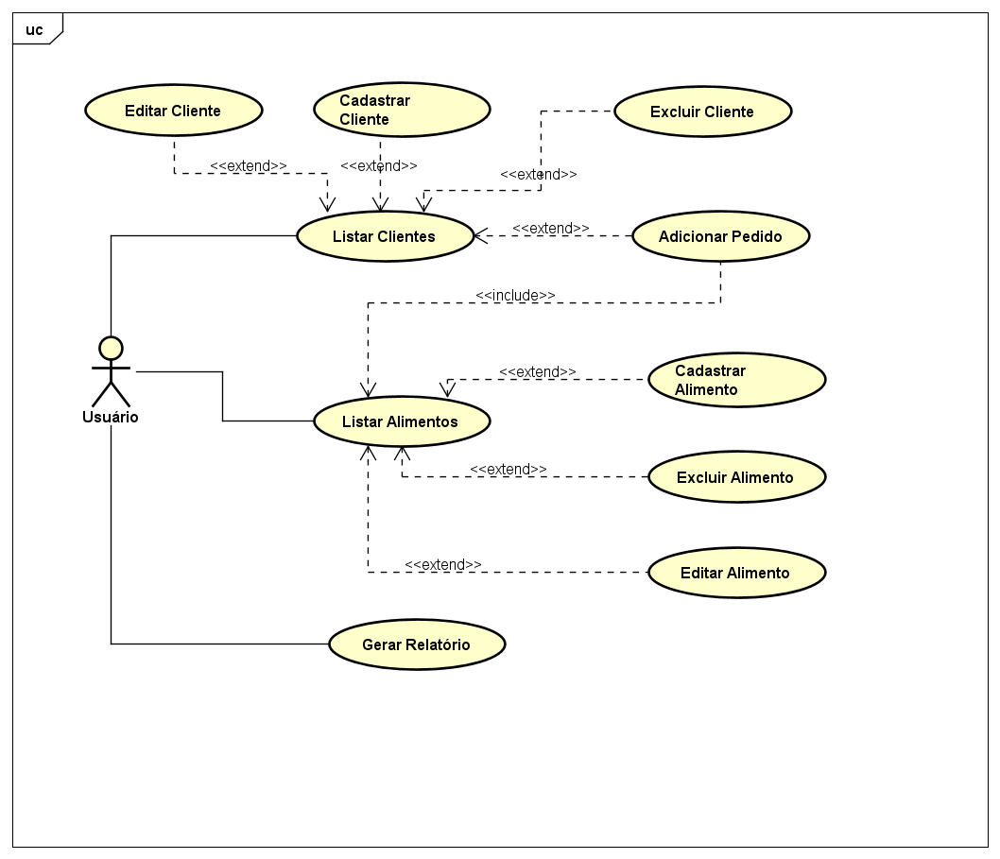
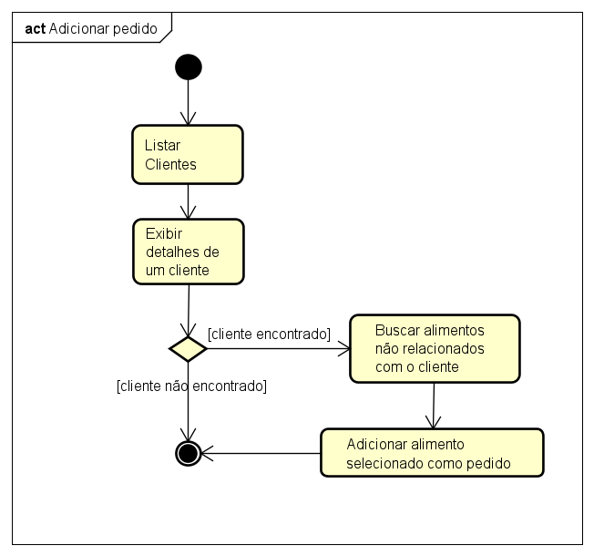

# Food&Travel
> Equipe: Lyncon Baez e Lucas Tomio Darim

 

Este projeto foi desenvolvido pela equipe como um trabalho da matéria de Introdução à Engenharia de Software, para demontrar os conhecimentos aprendidos durante o curso em relação diagramas de caso de uso UML e boas práticas de programação.  

## Casos de Uso

| Caso de Uso | Cadastrar Cliente |
| ----------- | ----------- |
| Objetivo | Permitir que o  usuário adicione um novo cliente ao sistema|
| Atores | Usuário |
| Pré-condições | Nenhuma |
| Fluxo Principal | 1. Selecionar "Clientes" no menu principal 2. Clicar "Cadastrar cliente" 3. Informar o nome 4. Informar a data de nascimento 5. Informar o número de viagens 6. Clicar em "Cadastrar" 7. Caso os dados estejam certos o cliente é adicionado e o caso de uso se encera |
| Fluxo Alternativo | 1. Selecionar "Clientes" no menu principal 2. Clicar "Cadastrar cliente" 3. Informar o nome 4. Informar a data de nascimento 5. Informar o número de viagens negativo 6. Clicar em "Cadastrar" 7. O caso de uso encera mostrando um erro e o novo cliente não é adicionado |
 
   

## Diagrama de Atividades

   

## Descrição do Software

Este software foi desenvolvido com o intuito de ser uma aplicação web, então para acessá-lo basta executar o programa e buscar por localhost:8080 no navegar, dessa forma será apresentado a tela inicial. No menu principal será apresentado três opções sendo estas Clientes, Alimentos e Gerar Relatório. 

Na aba Clientes há um botão para cadastrar um novo cliente permitindo que o usuário adicione novos clientes e tabela mostrando todos os clientes já cadastrados com seus respectivos dados. Ao lado de cada um dos clientes há três botões Excluir, Editar e Detalhes. Excluir possibilita eliminar um cliente do sitema; Editar permite alterar os dados que foram atribuidos ao cliente, exceto os pedidos feitos por este; e Detalhes mostra os dados do cliente juntamente com o histórico atual e completo de pedidos, ademais permite adicionar novos pedidos ao histórico.

Já na aba de Alimentos há um botão para cadastrar um novo alimento e duas tabelas sendo a primeira de alimentos disponíveis e a segunda de alimentos já excluidos que não podem mais serem pedidos. Para a tabela de alimentos disponíveis há os dados dos alimentos com dois botões ao lado, Excluir e Editar, no caso da tabela de alimentos ecluidos há apenas os dados dos alimentos. O botão Excluir faz com que o alimento não possa mais ser pedido pelos clientes e que o alimento seja movido para a outra tabela; e Editar possibilita modificar os dados atribuidos ao alimento. Caso ao cadastrar ou editar um alimento não seja incluido uma marca, será exibido um valor padrão "Sem Marca" na tabela.

Por fim a opção de Gerar Relatório, baixa um arquivo de texto contendo todos os clientes com os pedidos feitos de alimentos disponíveis. Caso um cliente ou alimento seja excluído, não aparecerá no relatório. O nome do arquivo baixado é relatorio seguido por alguns números aleatórios para garantir que múltiplos relatórios sejam gerados sem que seja sobrescritos os anteriores. A transferência é realizada para o diretório padrão de downloads do navegador do usuário.

No diretório raiz do projeto há um arquivo de log chamado logs.txt neste serão armazenados todos os erros que aconteceram no sistema. Cada log é formado pela data e descrićão do ocorrido. Por exemplo caso tente-se criar um usuário com número de viagens negativo, este não será cadastrado e será gerado um log da situação.
